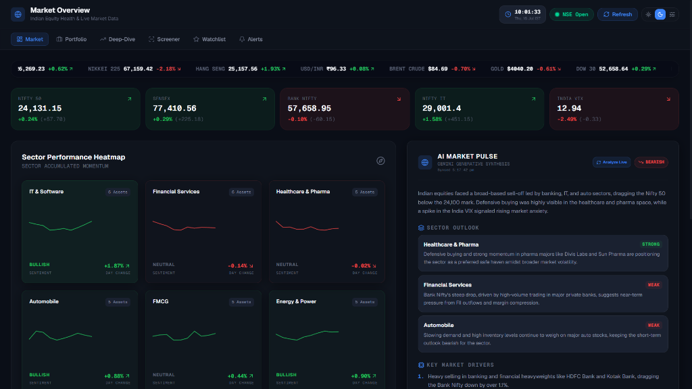
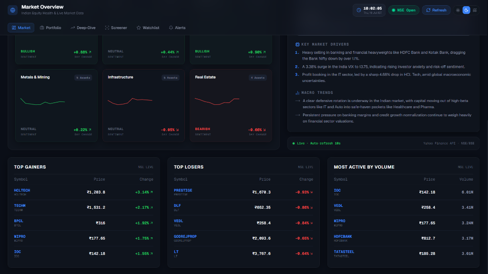
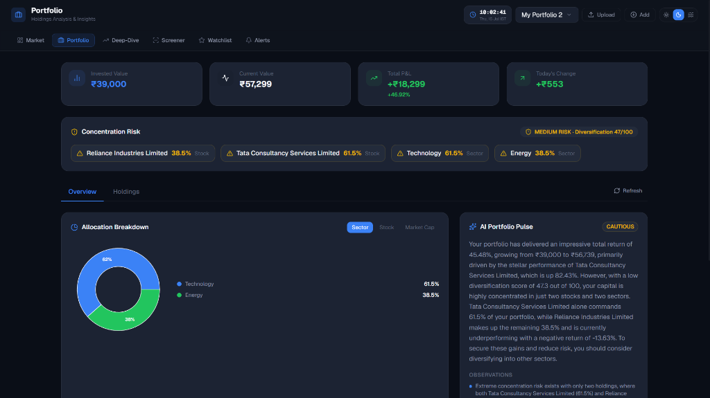
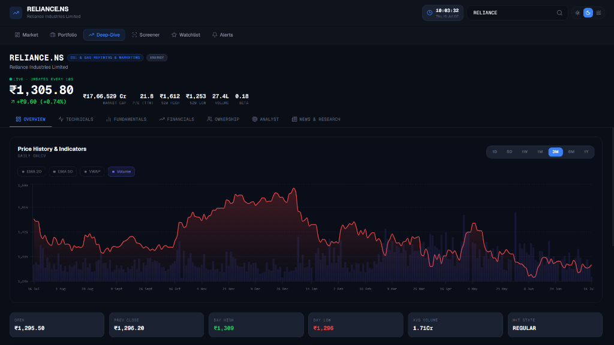
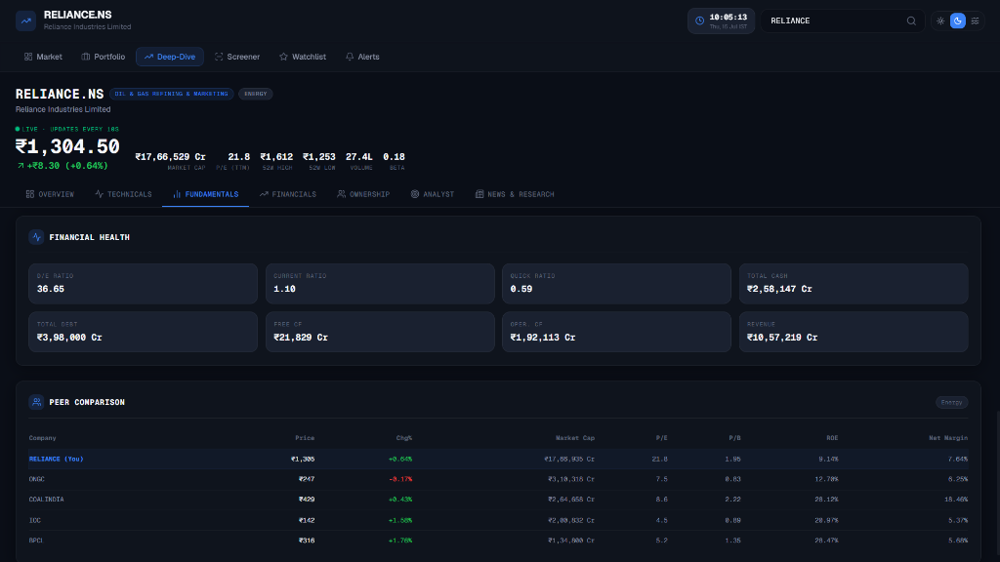
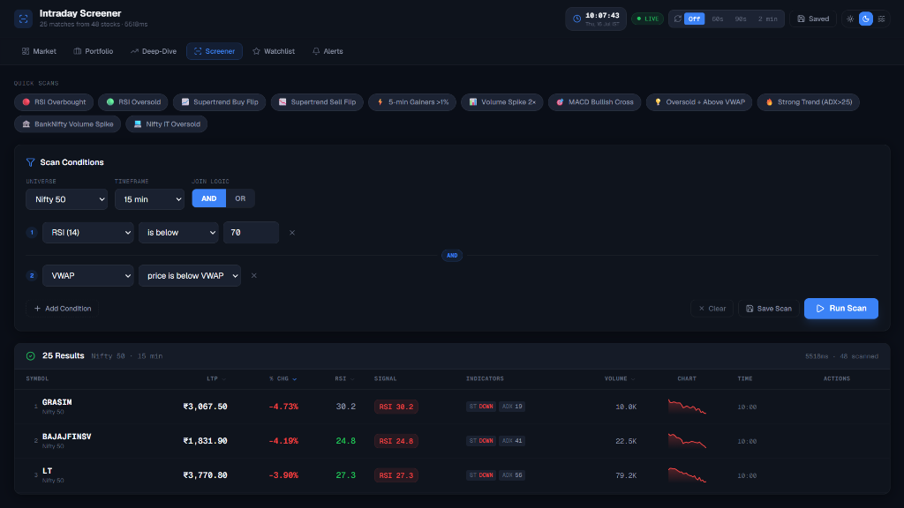
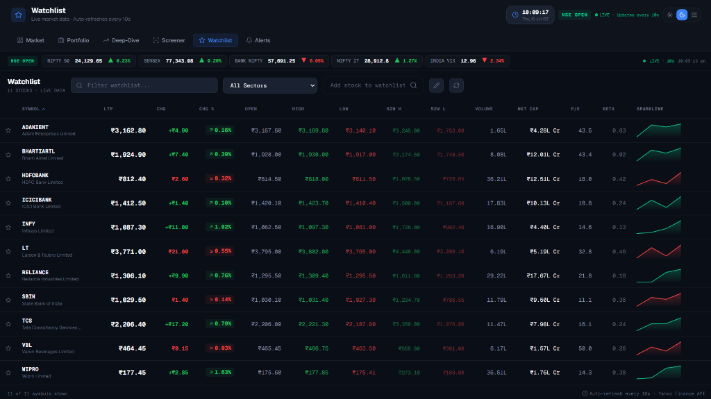

# Market Rover: AI Equity Hub

Market Rover is a premium, AI-powered equity analysis and portfolio management platform designed for modern investors. It provides live market data, interactive charting, intraday screening, and deeply integrated AI narratives powered by Google Gemini.

## Screenshots
<div align="center">
  
  
  
  
  
  
  
</div>


## Key Features
- **Live Market Data:** Real-time tracking of NIFTY 50, SENSEX, and individual equities via Yahoo Finance.
- **AI Integration (Gemini 3.1 Flash Lite):** Instant, intelligent generation of Research Notes, Market Pulses, and Portfolio Diversification analyses.
- **Portfolio Management:** Upload broker CSVs or manually enter trades to view rich dashboards analyzing your asset allocation, P&L, and concentration risks.
- **Intraday Screener & Watchlist:** Auto-refreshing watchlists (10s intervals) with visual flash indicators for rapid price movements.
- **Premium UI:** A unified, responsive TopBar layout supporting multiple dynamic themes (Dark, Light, Deep Blue) built with Next.js and Tailwind CSS.

---

## Technical Stack
- **Frontend:** Next.js 15 (App Router), React, Tailwind CSS, Recharts, Lucide React.
- **Backend:** FastAPI (Python), Uvicorn, Pandas, `yfinance`.
- **Database:** Supabase (PostgreSQL).
- **AI:** Google Generative AI API.

For detailed technical specifications, refer to [architecture.md](./architecture.md), [design.md](./design.md), and [rules.md](./rules.md).

---

## Local Development Setup

### 1. Prerequisites
- Node.js (v18+)
- Python (3.9+)
- A Supabase account (for database hosting)
- A Google Gemini API key

### 2. Database Setup (Supabase)
1. Create a new Supabase project.
2. Navigate to the SQL Editor in your Supabase dashboard.
3. Open `backend/schema_portfolio.sql` (and any other schema files provided).
4. Copy and execute the SQL to generate the required tables (`portfolios`, `holdings`, `isin_symbol_map`, `portfolio_ai_narratives`).

### 3. Backend Setup
1. Navigate to the `backend` directory:
   ```bash
   cd backend
   ```
2. Create and activate a virtual environment:
   ```bash
   python -m venv .venv
   # Windows
   .venv\Scripts\activate
   # Mac/Linux
   source .venv/bin/activate
   ```
3. Install dependencies:
   ```bash
   pip install -r requirements.txt
   ```
4. Create a `.env` file in the `backend` directory:
   ```env
   SUPABASE_URL=your_supabase_project_url
   SUPABASE_KEY=your_supabase_anon_key
   GEMINI_API_KEY=your_google_gemini_api_key
   ```
5. Run the FastAPI server:
   ```bash
   python -m uvicorn app.main:app --reload
   ```

### 4. Frontend Setup
1. Navigate to the `frontend` directory:
   ```bash
   cd frontend
   ```
2. Install dependencies:
   ```bash
   npm install
   ```
3. Run the Next.js development server:
   ```bash
   npm run dev
   ```
4. Open your browser to `http://localhost:3000`.

---

## Documentation
- **[Product Requirements (PRD)](./prd.md)**
- **[System Architecture](./architecture.md)**
- **[Design System](./design.md)**
- **[Project Rules](./rules.md)**
